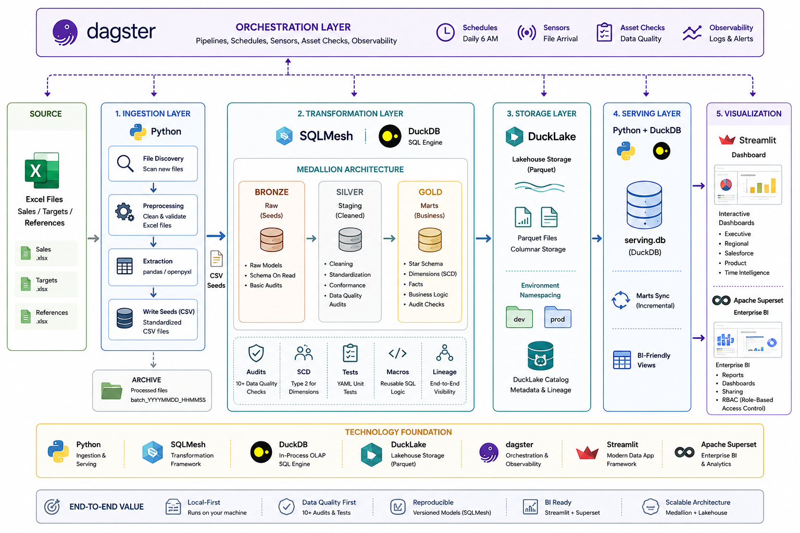

# 🏗️ Sales Analytics Platform

> **A production-grade, local-first data pipeline** that transforms raw Excel sales reports into analytics-ready datasets using Medallion architecture, SQLMesh, and DuckDB.

[](https://www.python.org/)
[](https://duckdb.org/)
[](https://sqlmesh.com/)
[](https://ducklake.select/)
[](https://dagster.io/)
[](https://streamlit.io/)
[](https://docs.pytest.org/)

---

## 🆕 Recent changes — KP-SD (sell-in) ingestion

A second ingestion source, **KP-SD**, was added: it captures what each Key Player invoices/ships to each Sub-Distributor (sell-in), complementing the existing SD → market **sales** source (sell-out). Highlights:

- New extractors: `KPDestockeExtractor` (`ExKP-Destocke_*.xlsx`, one file per SD) and `KPNonDestockeExtractor` (`ExKP-NonDestocke.xlsx`, single file)
- New gold fact: `fact_kp_sd` (`INCREMENTAL_BY_TIME_RANGE`, partitioned by `sale_year`/`sale_month`)
- `dim_clientsd`'s SCD Type 2 logic moved from the staging layer up into the gold model itself (`kind SCD_TYPE_2_BY_COLUMN`, keyed on `effective_from`); `stg_clientsd_data` is now a plain `FULL` model over the raw dated history
- A new `ingestion/contracts/` mechanism (`contracts.yaml` + `loader.py`) centralizes declared source schemas, replacing inline column sets scattered across extractors
- The reporting (Streamlit) and orchestration (Dagster) layers have **not** been updated for this new source yet — that work, plus two data-quality gaps found while reviewing the branch, are tracked in `IMPROVEMENT_PLAN.md`

---

## 🏛️ Architecture Overview

**The Problem:** Sales teams generate fragmented Excel reports (sales, targets, references) with no consistent schema, making BI integration painful and error-prone.

**The Solution:** A production-grade local-first analytics platform orchestrated with Dagster.
The pipeline ingests Excel files using Python, transforms data with SQLMesh and DuckDB with data quality enforcement,
stores models in DuckLake parquet-backed storage, serves marts through DuckDB,
and powers Streamlit and Power BI dashboards.



### Distribution chain modeled

The platform models two tiers of the distribution chain, each backed by its own fact table:

| Tier | Direction | Fact table | Source files | Business meaning |
|---|---|---|---|---|
| **Sell-in** | Key Player (KP) → Sub-Distributor (SD) | `fact_kp_sd` | `ExKP-Destocke_*.xlsx`, `ExKP-NonDestocke.xlsx` | What each KP invoiced/shipped to each SD |
| **Sell-out** | SD → market, via salesperson or *demi-gros* (DG) vendeur | `fact_sales` | `ExSD-Sales-*.xlsx` | What actually moved out of the SD to end retail |

Having both tiers side by side is what enables sell-in vs. sell-out reconciliation, SD ordering/overstock signals, and promo-attainment measurement (an SD's promo target is checked against what it bought from the KP, not what it later resold). See `IMPROVEMENT_PLAN.md` for the views/pages that expose this.

---

## ✨ Key Highlights

| Feature | Implementation |
|---|---|
| **Medallion Architecture** | Bronze (raw seeds) → Silver (staging) → Gold (marts) |
| **Data Quality Gates** | 10+ audits: uniqueness, referential integrity, null-key flagging, XAF integer amounts, SCD window overlap, data freshness SLA |
| **SCD-Aware Dimensions** | Slowly Changing Dimension Type 2 logic for clients, products, and salespeople |
| **DuckLake Storage** | Parquet-backed models with environment namespacing (`dev` / `prod`) |
| **Orchestrated DAG** | Dagster assets with file sensors, daily schedules, and asset checks |
| **BI-Ready Serving** | Decoupled DuckDB (`serving_<env>.db`) for Streamlit + external tools |
| **Quack Protocol** | Optional client-server mode: zero BI downtime, concurrent connections (DuckDB ≥ v1.5.2, beta) |
| **Export Services** | Async, event-triggered CSV and Parquet exports — optional, independently toggled |
| **Dead-Letter Handling** | Corrupt or unprocessable files are moved to `data/dead_letter/` instead of blocking future runs |
| **Local-First** | Zero cloud dependencies; runs entirely on your machine |

---

## Directory Structure

```
sales-analytics-platform/
├── ingestion/              # Data extraction layer
│   ├── config/             # settings.py (absolute paths), sources.yaml
│   ├── contracts/          # contracts.yaml + loader.py — declared column schemas
│   │                       # per source (required vs. expected columns), consumed
│   │                       # by extractors instead of inline column sets.
│   ├── extract/            # BaseExcelExtractor, SalesExtractor, TargetExtractor,
│   │                       # ReferenceExtractor, KPDestockeExtractor,
│   │                       # KPNonDestockeExtractor, PromoBouclageExtractor
│   ├── load/               # SeedWriter — writes CSV seeds + metadata
│   └── orchestrate/        # FileDiscovery, ExcelPreprocessor, ArchiveManager
│
├── sqlmesh/                # Transformation layer
│   ├── seeds/              # CSV files written by ingestion (gitignored)
│   ├── models/
│   │   ├── raw/            # Bronze: seed-loading models (sales, targets, references,
│   │   │                   # kp_sd_destocke, kp_sd_non_destocke, kp_sku_mapping)
│   │   ├── staging/        # Silver: type casting, null handling, deduplication
│   │   │                   # (stg_kp_sd_data unions destocké + non-destocké)
│   │   └── marts/
│   │       ├── dimensions/ # dim_clientsd (SCD2), dim_date, dim_salesperson, dim_products
│   │       ├── facts/      # fact_sales (sell-out), fact_kp_sd (sell-in), fact_targets
│   │       └── reports/    # rep_weekly_meeting, rep_top_products, rep_target_attainment
│   ├── audits/             # One AUDIT block per file — each returns failing rows
│   │   ├── assert_no_orphaned_salesperson.sql
│   │   ├── assert_no_orphaned_product.sql
│   │   ├── assert_no_orphaned_client.sql
│   │   ├── assert_amount_matches_qty_x_price.sql
│   │   ├── assert_no_overlapping_scd_windows.sql
│   │   ├── assert_amount_is_integer_xaf.sql
│   │   ├── assert_sales_data_is_fresh.sql
│   │   ├── assert_no_orphaned_product_kp.sql
│   │   ├── assert_no_orphaned_client_kp.sql        # ⚠ not yet wired into fact_kp_sd — see IMPROVEMENT_PLAN.md
│   │   ├── assert_amount_matches_qty_x_price_kp.sql
│   │   ├── assert_amount_is_integer_xaf_kp.sql
│   │   └── assert_no_unmapped_kp_sku.sql           # ⚠ defined but not referenced by any model yet
│   ├── macros/             # clean_currency.sql (XAF formatting)
│   └── tests/              # SQLMesh YAML unit tests
│
├── data/                   # Local data storage (gitignored)
│   ├── source/             # Synced from SharePoint / local share (read-only)
│   ├── input/              # Preprocessed Excel files ready for extraction
│   ├── archive/            # Processed files, batched as batch_YYYYMMDD_HHMMSS/
│   ├── dead_letter/        # Corrupt or unprocessable files — investigate and remove
│   ├── warehouse/          # DuckLake catalog + serving DBs + Parquet storage
│   └── exports/            # CSV and Parquet exports (csv/<env>/, parquet/<env>/)
│
├── serving/                # Serving layer
│   ├── sync.py             # ServingLayerSync (file-swap or Quack), QuackServer
│   ├── config.py           # ServingConfig, QuackConfig, ExportConfig
│   ├── cli.py              # CLI: sync, serve, export, validate, stats
│   ├── export/             # Async, event-triggered export services
│   │   ├── events.py           # SyncCompletedEvent
│   │   ├── base_exporter.py    # BaseExporter ABC + ExportResult
│   │   ├── csv_exporter.py     # CsvExporter
│   │   ├── parquet_exporter.py # ParquetExporter
│   │   ├── event_bus.py        # ExportEventBus (publish_and_wait / publish_background)
│   │   └── __init__.py
│   └── templates/          # bi_views.sql — 13 BI-ready views
│
├── orchestration/          # Dagster pipeline
│   ├── assets/             # file_discovery, preprocessing, ingestion, transformation, serving, data_quality
│   ├── config.py           # PipelineConfig (typed env-var schema via Pydantic BaseSettings)
│   ├── jobs/               # daily_pipeline, ingestion_only, transformation_only, serving_only
│   ├── schedules/          # 6 AM daily, midday
│   ├── sensors/            # new_file_sensor, sync_health_sensor, prod_promotion_sensor
│   └── resources/          # DuckDBResource, DuckLakeResource, SQLMeshResource, QuackResource
│
├── shared/                 # Shared path constants (imported by both ingestion and orchestration)
│   └── paths.py
│
├── tests/                  # pytest suite
│   ├── ingestion/          # Unit tests for extractors, preprocessor, seed writer
│   ├── serving/            # Integration test against fixture DuckLake
│   ├── orchestration/      # Unit tests for constants, serving helpers, data quality
│   └── fixtures/           # Minimal DuckLake catalog + seed CSV files for CI
│
├── reporting/              # Streamlit dashboards
│   ├── pages/              # Executive, Regional, Salesforce, Product, Time Intelligence
│   ├── utils/              # DB connection, queries, formatters, filters
│   └── Components/         # KPI cards, charts, ranking tables
│
├── .env.example            # All environment variables with types and defaults
├── COLD_START.md           # Fresh-clone procedure (SQLMesh state, first plan)
└── sqlmesh_state.db        # SQLMesh run state (outside data/ so it survives git clone)
```

---

## Pipeline Stages

### 1. Ingestion (`ingestion/`)

Handles everything from raw Excel files to CSV seeds.

**Orchestrate**

- `file_discovery.py` — scans source directories using UTC-aware timestamps; builds a processing manifest with per-file preprocessing rules
- `excel_preprocessor.py` — strips `Synthese *` sheets from `ExSD-*.xlsx` files with retry logic on locked files; failed files move to `data/dead_letter/`
- `archive_manager.py` — copies processed files to `data/archive/batch_<pipeline_batch_id>/` using the same `batch_id` as the seed metadata

**Extract**

Typed extractor classes parse each Excel file against expected schemas. All raw rows are preserved — null-key rows (missing `sale_date` or `sku`) are flagged with `has_null_key = True` rather than dropped silently. Filtering belongs in the staging layer where it is auditable.

**Load**

`seed_writer.py` writes cleaned data to `sqlmesh/seeds/*.csv` with companion `*_metadata.txt` tracking files.

**Seeds produced:**

| Seed File | Source | Notes |
|---|---|---|
| `sales_data.csv` | `ExSD-Sales-*.xlsx` | Includes `has_null_key` column. Sell-out. |
| `targets_data.csv` | `Sales_Targets.xlsx` | |
| `clientSD_data.csv` | `References.xlsx` → Ref_ClientsSD | Now includes `effective_from`; drives dim_clientsd SCD2 |
| `products_data.csv` | `References.xlsx` → Ref_Products | |
| `salesteam_data.csv` | `References.xlsx` → Ref_Salesteam | |
| `kp_sku_mapping_data.csv` | `References.xlsx` → Ref_sku_mapping | KP-native SKU → internal SKU. ⚠ Not yet joined in by any staging/mart model — see `IMPROVEMENT_PLAN.md` |
| `kp_sd_destocke_data.csv` | `ExKP-Destocke_*.xlsx` | One file per SD; sell-in, destocké channel |
| `kp_sd_non_destocke_data.csv` | `ExKP-NonDestocke.xlsx` | Single file; sell-in, non-destocké channel |

**Dead-letter handling**

Files that fail preprocessing or are structurally corrupt are moved to `data/dead_letter/batch_<timestamp>/` instead of remaining in `data/input/`. A Dagster asset check alerts when the dead-letter directory is non-empty. Remove or fix dead-letter files before the next pipeline run.

---

### 2. Transformation (`sqlmesh/`)

Medallion architecture running on DuckDB with DuckLake for Parquet-backed storage.

| Layer | Models | Purpose |
|---|---|---|
| **Bronze (Raw)** | `raw_sales`, `raw_targets`, `raw_clientsd`, `raw_products`, `raw_salesteam`, `raw_kp_sd_destocke_data`, `raw_kp_sd_non_destocke_data`, `raw_kp_sku_mapping_data` | Load CSV seeds verbatim — all columns as strings |
| **Silver (Staging)** | `stg_sales_data`, `stg_targets_data`, `stg_clientsd_data`, `stg_products_data`, `stg_salesteam_data`, `stg_kp_sd_data`, `stg_kp_sku_mapping` | Type casting, null handling, `has_null_key` filtering. `stg_kp_sd_data` is a `UNION ALL` of the destocké and non-destocké sources, tagging each row with `is_destocked` / `source_asserted_destocked`. `stg_clientsd_data` is now `FULL` (raw dated history, one row per `(sd_id, effective_from)`) — the SCD2 collapse itself now happens one layer up, in `dim_clientsd` |
| **Gold (Dimensions)** | `dim_clientsd` (`SCD_TYPE_2_BY_COLUMN`, `updated_at_name effective_from`), `dim_date`, `dim_salesperson`, `dim_products` | Slowly Changing Dimensions Type 2 |
| **Gold (Facts)** | `fact_sales` (sell-out, `INCREMENTAL_BY_TIME_RANGE`), `fact_kp_sd` (sell-in, `INCREMENTAL_BY_TIME_RANGE`, partitioned by `sale_year`/`sale_month`), `fact_targets` | Star schema facts with FK integrity audits |
| **Reports** | `rep_weekly_meeting`, `rep_top_products`, `rep_target_attainment` | Pre-aggregated report views |

Macros (`macros/clean_currency.sql`) handle currency formatting (XAF — integer amounts, no subunit).

**SCD joins**

All SCD Type 2 joins use an explicit open-ended range guard:

```sql
-- Correct — handles current records where valid_to IS NULL
ON s.sale_date >= d.valid_from
AND (d.valid_to IS NULL OR s.sale_date < d.valid_to)

-- Do NOT use BETWEEN — it evaluates to NULL when valid_to IS NULL,
-- silently dropping every sale linked to the current dimension version.
```

**Audits**

SQLMesh requires exactly one `AUDIT` block per file. Each audit returns failing rows (not a count), making root-cause tracing immediate. SQLMesh resolves audits by name at plan/run time.

| Audit file | Model(s) | Checks |
|---|---|---|
| `assert_no_orphaned_salesperson.sql` | `fact_sales` | No NULL `salesperson_key` after SCD join |
| `assert_no_orphaned_product.sql` | `fact_sales` | No NULL `product_key` after SCD join |
| `assert_no_orphaned_client.sql` | `fact_sales` | No NULL `clientsd_key` after SCD join |
| `assert_amount_matches_qty_x_price.sql` | `fact_sales` | `total_amount` within 1% of `qty × unit_price` |
| `assert_no_overlapping_scd_windows.sql` | `dim_clientsd`, `dim_products`, `dim_salesperson` | No two active rows for the same key in the same date range |
| `assert_amount_is_integer_xaf.sql` | `fact_sales` | `total_amount = FLOOR(total_amount)` — XAF has no subunit |
| `assert_sales_data_is_fresh.sql` | `stg_sales_data` | `MAX(sale_date) >= CURRENT_DATE - INTERVAL 7 DAYS` |
| `assert_no_orphaned_product_kp.sql` | `fact_kp_sd` | No NULL `product_key` after SCD join (active) |
| `assert_amount_matches_qty_x_price_kp.sql` | `fact_kp_sd` | `total_amount` within 1% of `quantity × unit_price` (active) |
| `assert_amount_is_integer_xaf_kp.sql` | `fact_kp_sd` | `total_amount = FLOOR(total_amount)` (active) |
| `assert_no_orphaned_client_kp.sql` | `fact_kp_sd` | No NULL `clientsd_key` after SCD join — **file exists but is commented out in `fact_kp_sd`'s `audits()` block, so it never runs. See `IMPROVEMENT_PLAN.md`.** |
| `assert_no_unmapped_kp_sku.sql` | *(none)* | Would check every `sku` resolves in `dim_products` — **not referenced by any model's `audits()` block, so it never runs.** |

> ⚠️ Two data-quality gaps carried over from the current branch: an orphaned-client check for KP-SD data exists on disk but isn't wired in, and a SKU-mapping check exists but isn't attached to any model. Both are flagged as high-priority fixes in `IMPROVEMENT_PLAN.md` — they're the kind of silent-drop risk this project has otherwise been careful to avoid.

---

### 3. Serving (`serving/`)

Copies Gold mart tables from the DuckLake warehouse into a standalone DuckDB serving file that BI tools connect to directly. This decouples the transformation layer from downstream consumers.

**Env-aware serving DB naming:**

| Environment | Serving file |
|---|---|
| `dev` | `data/warehouse/serving_dev.db` |
| `prod` | `data/warehouse/serving.db` |

**BI views** (`serving/templates/bi_views.sql`)

13 SQL views are applied to the serving DB after sync, providing a semantic layer for all BI tools:

| View | Grain | Purpose |
|---|---|---|
| `v_sales_base` | sales line | Denormalized fact with all dimension attributes |
| `v_monthly_kpi` | month × salesperson × category | Revenue vs. target FULL OUTER JOIN |
| `v_ytd_kpi` | year × salesperson × category | Year-to-date rollup |
| `v_weekly_kpi` | week × salesperson | Weekly activity |
| `v_quarterly_kpi` | quarter × salesperson × category | Quarterly with dim_date quarter mapping |
| `v_regional_kpi` | month × region | Regional breakdown |
| `v_salesperson_kpi` | month × salesperson | Per-rep metrics |
| `v_product_kpi` | month × product | Revenue by product |
| `v_client_kpi` | month × client | Revenue by client |
| `v_innovation_kpi` | month × category | Innovation vs. standard split |
| `v_yoy_comparison` | month × salesperson | Year-over-year delta |
| `v_executive_summary` | month | Single-row period summary |
| `v_targets_base` | target line | Denormalized target with salesperson attributes |
| `v_kp_sd_base` | KP-SD line | Denormalized `fact_kp_sd` with product + client attributes (sell-in) |
| `v_kp_sd_monthly_kpi` | month × SD × KP × category | Sell-in revenue/qty rollup |
| `v_kp_performance_kpi` | month × KP | Revenue per Key Player across all its SDs |
| `v_sellin_sellout_kpi` | month × SD | Sell-in (`fact_kp_sd`) vs. sell-out (`fact_sales`/`v_client_kpi`) side by side, with a sell-through ratio |

*(the four KP-SD views above are new — see `IMPROVEMENT_PLAN.md` for the SQL and the reporting page that consumes them)*

**Two sync strategies**, chosen via `ServingConfig`:

#### File-Swap (default)

Tables are written into a temp DuckDB file then atomically renamed. Simple, zero extra dependencies, suitable for production.

#### Quack (opt-in, DuckDB ≥ v1.5.2 — beta)

A persistent Quack server wraps the serving DB. The sync rewrites tables in-place via a single SQL statement — no temp file, no rename, no BI outage.

> ⚠️ **Quack is currently in beta.** Stable release planned for DuckDB v2.0 (September 2026). Use file-swap in production until then.

#### Export Services (`serving/export/`)

CSV and Parquet exports are decoupled from the sync as independent, async, event-triggered services. They are fully optional — no exporters registered means no exports, no config changes needed.

| Class | Purpose |
|---|---|
| `CsvExporter` | UTF-8 CSV for Excel, Power Query, Pandas |
| `ParquetExporter` | Columnar Parquet for analytics and data science |
| `ExportEventBus` | `publish_and_wait` (blocking) or `publish_background` (fire-and-forget) |

---

### 4. Orchestration (`orchestration/`)

Dagster manages the end-to-end pipeline as a DAG of software-defined assets:

```
current_batch_id
  └── discovered_files → files_to_process → preprocessed_files
        └── sales_seed, targets_seed, references_seeds → seeds_metadata
              └── sqlmesh_models → marts_validation
                    └── serving_database → pipeline_complete
```

Asset check `data_quality_full_report` runs after `fact_sales` materialises. It queries each audit function directly against DuckDB, traces failing rows back to their source Excel file, and writes a structured JSON report to `data/exports/quality_reports/`. `blocking=False` — a failed audit shows a red badge in the Dagster UI but does not stop downstream assets.

**Jobs:**

| Job | Triggers |
|---|---|
| `daily_pipeline_job` | Daily schedule (6 AM) and file sensor |
| `ingestion_only_job` | Manual — discovery through seed writing |
| `transformation_only_job` | Manual — SQLMesh plan + run |
| `serving_only_job` | Manual — sync + optional exports |

**Sensors:**

| Sensor | Purpose |
|---|---|
| `new_file_sensor` | Triggers pipeline when new files arrive in `data/source/` |
| `sync_health_sensor` | Alerts when `failed_syncs > 0` or sync duration spikes |
| `prod_promotion_sensor` | Only triggers prod pipeline after a successful dev run in the last 24 h |

---

### 5. Reporting (`reporting/`)

Streamlit multi-page app connecting to the env-aware serving DB:

| Page | Content |
|---|---|
| Executive Overview | High-level KPIs and trends |
| Regional Performance | Sales breakdown by region |
| Salesforce Performance | Per-rep metrics vs. targets |
| Product Performance | Revenue by product |
| Time Intelligence | Period-over-period comparisons |
| Data Quality | Audit pass/fail trends (`bi.quality_trend`) |
| Ask Your Data | Free-form querying |
| **Sell-In / Sell-Out** *(new)* | KP shipment volumes to each SD vs. what the SD/DG resold, sell-through ratio, KP-level rollup |

---

## Setup

### Prerequisites

- Python 3.10+
- DuckDB ≥ v1.5.2 (for Quack mode; v1.1+ for everything else)

### Install

```bash
pip install -e ".[dev]"
```

The `[dev]` extras install `pytest`, `ruff`, and `mypy` for the test suite and CI.

### Configure

**1. Copy the environment template:**

```bash
cp .env.example .env
```

Edit `.env` with your values. Every variable has a type, default, and description in `.env.example`. The minimum required set for local development:

```bash
SQLMESH_ENV=dev
DUCKDB_PATH=data/warehouse/serving_dev.db
ENABLE_QUACK=false
ENABLE_CSV_EXPORT=false
ENABLE_PARQUET_EXPORT=false
```

**2. Edit source paths** in `ingestion/config/sources.yaml` to point to your SharePoint sync folder or local directory.

**3. Review model config** in `sqlmesh/config.yaml` — DuckDB connection, DuckLake path, and environments are set here.

### Fresh clone (cold start)

SQLMesh run state (`sqlmesh_state.db`) is not in `data/` (which is gitignored) — it lives at the project root and can be committed. On a fresh clone with no state file, initialise the pipeline from the beginning:

```bash
cd sqlmesh
sqlmesh plan dev --start 2024-10-01 --auto-apply
```

See `COLD_START.md` for a full step-by-step procedure including data seeding.

---

## Running the Pipeline

### Full pipeline via Dagster

```bash
dagster dev --working-directory orchestration
# Open http://localhost:3000 → Assets → Materialize all
```

Or from the CLI:

```bash
dagster asset materialize --select '*'
```

### Individual stages

```bash
# Ingestion — dry run (no files written)
python -m ingestion.main --dry-run

# Ingestion — full run
python -m ingestion.main

# Ingestion — only files modified since a date
python -m ingestion.main --since 2025-06-01

# Transformation — validate SQL without writing data
cd sqlmesh && sqlmesh plan dev --no-gaps --start 2024-10-01

# Transformation — apply
cd sqlmesh && sqlmesh plan dev --start 2024-10-01 --auto-apply

# Transformation — run audits explicitly
cd sqlmesh && sqlmesh audit --start 2024-10-01

# Serving — sync to serving_dev.db
python -m serving.cli sync --env dev

# Serving — sync with exports
python -m serving.cli sync --env dev --csv --parquet

# Serving — validate freshness
python -m serving.cli validate --env dev

# Reporting
cd reporting && streamlit run app.py
```

### Isolated Dagster jobs

```bash
dagster job execute -j ingestion_only_job
dagster job execute -j transformation_only_job
dagster job execute -j serving_only_job
```

---

## Testing

The full test suite runs with:

```bash
pytest tests/ -v --tb=short
```

### Layer-by-layer

**Ingestion (pure Python, no data needed):**

```bash
pytest tests/ingestion/ -v
```

Covers: null-key flagging, workbook close on exception, retry sleep behaviour, UTC datetime comparisons, batch_id propagation to archive, seed write/read roundtrip.

**Transformation (SQLMesh YAML unit tests):**

```bash
cd sqlmesh && sqlmesh test
```

Each test in `sqlmesh/tests/` injects fixture rows and asserts the SELECT output. Runs against in-memory DuckDB in under 1 second — no real files needed. Also validates model SQL:

```bash
cd sqlmesh && sqlmesh plan dev --no-gaps --start 2024-10-01
# Press Ctrl-C at the apply prompt — syntax errors appear here
```

**Serving (integration test against fixture DuckLake):**

```bash
pytest tests/serving/ -v
```

Creates a minimal DuckLake catalog in `tests/fixtures/` with two mart tables, runs `ServingLayerSync.sync()`, and asserts that the serving DB exists, tables are present, and `validate_serving_db()` returns `True`. Runs in under 2 seconds.

### Smoke test (full stack, copy-paste)

```bash
# 1. SQL validation — no data written
cd sqlmesh && sqlmesh plan dev --no-gaps --start 2024-10-01 && cd ..

# 2. YAML unit tests
cd sqlmesh && sqlmesh test && cd ..

# 3. Ingest
python -m ingestion.main --dry-run   # preview
python -m ingestion.main             # real run

# 4. Transform and audit
cd sqlmesh
sqlmesh plan dev --start 2024-10-01 --auto-apply
sqlmesh audit --start 2024-10-01
cd ..

# 5. Sync and validate
python -m serving.cli sync --env dev
python -m serving.cli validate --env dev

# 6. Verify the SCD join fix (must return 0)
duckdb data/warehouse/serving_dev.db \
  -c "SELECT COUNT(*) FROM v_sales_base WHERE product_name IS NULL"

# 7. Full pytest suite
pytest tests/ -v --tb=short

# 8. Full Dagster run
dagster asset materialize --select '*'
```

---

## Serving Layer CLI

```bash
# Sync marts → serving DB
python -m serving.cli sync --env dev
python -m serving.cli sync --env prod --csv --parquet

# Sync with Quack (requires a running Quack server)
python -m serving.cli sync --env dev --quack --quack-token <token>

# One-off export from existing serving DB — no re-sync
python -m serving.cli export --env dev --csv
python -m serving.cli export --env dev --csv --csv-path /tmp/for-excel/
python -m serving.cli export --env prod --parquet --parquet-compression zstd

# Start a persistent Quack server
python -m serving.cli serve --env dev --quack-token <token>

# Check serving DB is fresh (exit 0 if synced within 24 h)
python -m serving.cli validate --env dev

# Print last-sync statistics
python -m serving.cli stats --env dev
```

**Export flags:**

| Flag | Description |
|---|---|
| `--csv` | Enable CSV export (UTF-8, comma-delimited by default) |
| `--csv-path DIR` | Override CSV output directory |
| `--csv-delimiter CHAR` | Column separator (default: `,`) |
| `--parquet` | Enable Parquet export |
| `--parquet-path DIR` | Override Parquet output directory |
| `--parquet-compression CODEC` | `snappy` (default), `zstd`, `gzip`, `brotli`, `lz4`, `uncompressed` |
| `--export-background` | Fire exports in a background thread; pipeline returns immediately |
| `--export-timeout SECONDS` | Max wait time in blocking mode (default: 300) |

---

## Quack Protocol

Quack turns DuckDB into a client-server database, enabling multiple processes to hold simultaneous read-write connections to the same serving DB.

> ⚠️ **Quack is currently in beta.** Stable release planned for DuckDB v2.0 (September 2026). Use file-swap in production until then.

### Why Quack improves the serving layer

| Problem (file-swap) | Solution (Quack) |
|---|---|
| Temp file + atomic rename dance | Sync writes directly to the live server; no temp file |
| BI clients locked out during rename | Server stays live; clients see new data atomically per table |
| Single-writer file lock | Multiple concurrent readers and writers |

### Setup

**1. Install the Quack extension** (DuckDB ≥ v1.5.2):
```sql
INSTALL quack FROM core_nightly;
LOAD quack;
```

**2. Start the Quack server:**
```bash
python -m serving.cli serve --env dev --quack-token your_secret_token
```

**3. Run the sync against the live server:**
```bash
python -m serving.cli sync --env dev --quack --quack-token your_secret_token
```

**4. Connect BI tools:**
```sql
LOAD quack;
CREATE SECRET (TYPE quack, TOKEN 'your_secret_token');
ATTACH 'quack:localhost:9494' AS serving;
SELECT * FROM serving.bi.fact_sales LIMIT 10;
```

---

## Export Services

CSV and Parquet exports are implemented as independent async services under `serving/export/`. Registering no exporters disables all exports with no config changes.

### Using the export bus

```python
from serving.config import ServingConfig
from serving.sync import ServingLayerSync
from serving.export import ExportEventBus, CsvExporter, ParquetExporter

config = ServingConfig(environment="dev")
config.normalize()

bus = (
    ExportEventBus()
    .subscribe(CsvExporter("data/exports/csv/dev"))
    .subscribe(ParquetExporter("data/exports/parquet/dev", compression="zstd"))
)

sync = ServingLayerSync(config, export_bus=bus)
sync.sync()
# → tables synced, then CSV and Parquet export concurrently
```

### Standalone export (no re-sync)

```python
from serving.export import CsvExporter
from serving.export.events import SyncCompletedEvent

exporter = CsvExporter("data/exports/csv/dev", delimiter=";")  # semicolon for French Excel
event = SyncCompletedEvent(
    environment="dev",
    serving_path="data/warehouse/serving_dev.db",
    bi_schema="bi",
    tables=["fact_sales", "dim_products"],
)
result = exporter.export(event)
```

### Adding a custom exporter

```python
from serving.export.base_exporter import BaseExporter

class JsonExporter(BaseExporter):
    format = "json"

    def export_table(self, conn, table_name, bi_schema, output_dir):
        out = output_dir / f"{table_name}.json"
        conn.execute(f"""
            COPY {bi_schema}.{table_name}
            TO '{out}' (FORMAT JSON, ARRAY true)
        """)

bus.subscribe(JsonExporter("data/exports/json/dev"))
```

---

## Data Storage

All data lives under `data/` (gitignored):

| Path | Contents |
|---|---|
| `data/source/` | Synced from SharePoint / local share (read-only) |
| `data/input/` | Preprocessed Excel files ready for extraction |
| `data/archive/` | Processed source files, batched by `batch_YYYYMMDD_HHMMSS` |
| `data/dead_letter/` | Corrupt or unprocessable files — investigate before next run |
| `data/warehouse/catalog.ducklake` | DuckLake catalog |
| `data/warehouse/serving_dev.db` | Dev serving DB — connect BI tools here during development |
| `data/warehouse/serving.db` | Prod serving DB — stable path for production BI tools |
| `data/warehouse/parquet_storage/` | Parquet files per model and environment |
| `data/exports/csv/<env>/` | CSV exports per environment |
| `data/exports/parquet/<env>/` | Parquet exports per environment |
| `data/exports/quality_reports/` | JSON quality reports from `data_quality_full_report` |

`sqlmesh_state.db` lives at the **project root**, not inside `data/`. This means it is not gitignored and survives a fresh clone. See `COLD_START.md`.

---

## Environment Variables

All runtime behaviour is controlled via environment variables. Copy `.env.example` to `.env` — every variable has a type annotation, default value, and one-line description.

| Variable | Type | Default | Description |
|---|---|---|---|
| `SQLMESH_ENV` | `str` | `dev` | Active SQLMesh environment (`dev` or `prod`) |
| `DUCKDB_PATH` | `str` | auto | Override serving DB path (default: resolved from `SQLMESH_ENV`) |
| `ENABLE_QUACK` | `bool` | `false` | Enable Quack client-server sync mode |
| `QUACK_HOST` | `str` | `localhost` | Quack server hostname |
| `QUACK_PORT` | `int` | `9494` | Quack server port |
| `QUACK_TOKEN` | `str` | — | Quack auth token (required when `ENABLE_QUACK=true`) |
| `ENABLE_CSV_EXPORT` | `bool` | `false` | Enable CSV export after sync |
| `CSV_DELIMITER` | `str` | `,` | CSV column separator |
| `ENABLE_PARQUET_EXPORT` | `bool` | `false` | Enable Parquet export after sync |
| `PARQUET_COMPRESSION` | `str` | `snappy` | Parquet codec (`snappy`, `zstd`, `gzip`, `brotli`, `lz4`) |
| `EXPORT_BACKGROUND` | `bool` | `false` | Fire exports in background thread; pipeline returns immediately |
| `EXPORT_TIMEOUT_SECONDS` | `int` | `300` | Max wait for blocking export completion |

---

## Development

### Environments

SQLMesh supports `dev` and `prod` environments. Use `dev` during development — Parquet storage is namespaced by environment (`raw__dev/`, `staging__dev/`, etc.) so dev and prod data never mix. The serving layer mirrors this: `serving_dev.db` for dev, `serving.db` for prod.

The `prod_promotion_sensor` enforces that a successful dev run exists in the last 24 hours before the prod pipeline job is allowed to trigger.

### Adding a New Data Source

1. Add an extractor in `ingestion/extract/` subclassing `BaseExcelExtractor`
2. Declare its schema in `ingestion/contracts/contracts.yaml` (`required_columns` / `expected_columns`) and load it via `ingestion.contracts.loader.load_contracts()` — this is the pattern introduced for the KP-SD sources; prefer it over inline column sets in the extractor
3. Register the source's file-discovery rule in `ingestion/config/sources.yaml`, **and** add the matching path to both `ingestion/config/settings.py`'s `SourceConfig`/`load_sources_config()` **and** `shared/paths.py`'s `INPUT_PATHS` — these are two independent dicts read by different consumers (FileDiscovery/preprocessing vs. extractors) and both need the new key
4. Add a seed entry in `sqlmesh/seeds/`
5. Create `raw_`, `stg_`, and mart models under `sqlmesh/models/`
6. Add a Dagster asset in `orchestration/assets/ingestion.py` (filter `preprocessed_files` by the new `source_type`, extract, write seed via `SeedWriter`), wire it into `seeds_metadata`'s `ins`, and add the branch to `orchestration/assets/preprocessing.py` if the source needs sheet-deletion/required-sheet rules (`preprocessing.py` hardcodes these per `source_type` in Python — it does **not** read `sources.yaml`'s `processing:` block, so the two must be kept in sync by hand)
7. Register the new asset in `orchestration/definitions.py`'s `assets` list

### Adding a Report Model

1. Create `sqlmesh/models/reports/rep_<name>.sql` with `kind FULL` and `start '2024-10-01'`
2. Add the corresponding view to `serving/templates/bi_views.sql`
3. Add a Streamlit page under `reporting/pages/`

### Adding a Custom Audit

1. Create `sqlmesh/audits/<audit_name>.sql` with a single `AUDIT (name ...) ; SELECT ... FROM @this WHERE ...` block — the SELECT returns failing rows, not a count
2. Reference the audit name inside the target model's `audits (...)` block
3. Run `cd sqlmesh && sqlmesh plan dev` — SQLMesh resolves audits by name automatically

### Adding a Custom Export Format

1. Create `serving/export/<format>_exporter.py`, subclass `BaseExporter`, implement `export_table()`
2. Register an instance on `ExportEventBus` in your pipeline entry point or Dagster asset
3. Optionally add a CLI flag in `serving/cli.py`'s `_add_export_args()`

---

## Dependencies

See `pyproject.toml` for the full list. Key packages:

| Package | Role |
|---|---|
| `sqlmesh[duckdb]` | SQL transformation framework |
| `duckdb` | Embedded analytical database |
| `ducklake` | Lightweight lakehouse |
| `dagster==1.12.12` | Pipeline orchestration |
| `dagster-webserver==1.12.12` | Dagster UI (pin to same version as dagster) |
| `dagster-duckdb` | DuckDB I/O manager for Dagster (pin to same version family) |
| `streamlit` | Reporting dashboards |
| `openpyxl` | Excel file reading (xlsx) |
| `pydantic[dotenv]` | Typed env-var config via `BaseSettings` |
| `pandas` | Data manipulation in ingestion layer |
| `pytest` | Test suite |
| `ruff` | Linting |

> **Dagster packages must be pinned together.** `dagster`, `dagster-webserver`, and `dagster-duckdb` share internal APIs. Always update them as a group.

> **The Quack extension is not a Python package.** Install it inside DuckDB: `INSTALL quack FROM core_nightly` (requires DuckDB ≥ v1.5.2).
