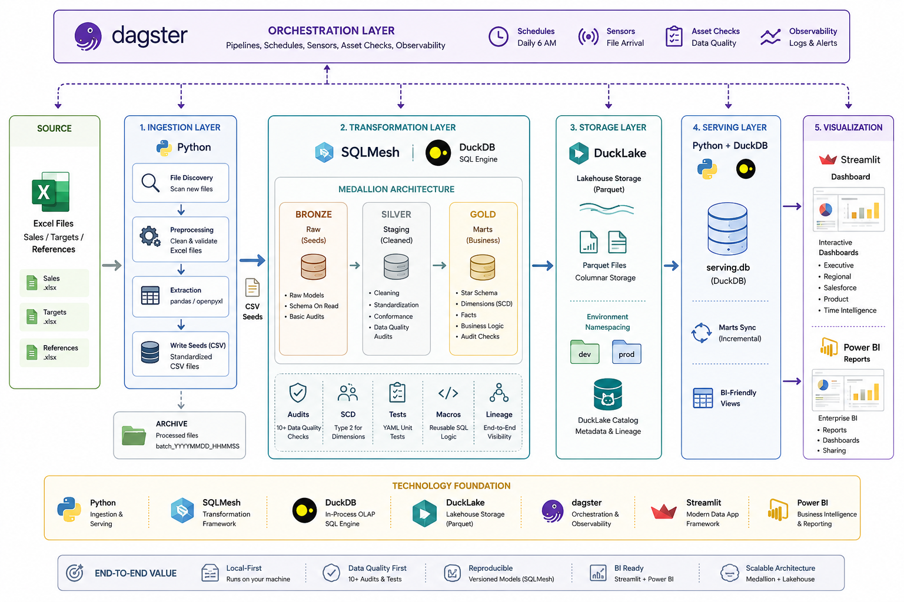

# 🏗️ Sales Analytics Platform

&gt; **A production-grade, local-first data pipeline** that transforms raw Excel sales reports into analytics-ready datasets using Medallion architecture, SQLMesh, and DuckDB.

[](https://www.python.org/)
[](https://duckdb.org/)
[](https://sqlmesh.com/)
[](https://ducklake.select/)
[](https://dagster.io/)
[](https://streamlit.io/)

---

## 📸 Overview

&lt;!--  --&gt;
| Ingestion | Star Schema | Streamlit Dashboard |
|:---:|:---:|:---:|
| `Excel → CSV Seeds` | `Bronze → Silver → Gold` | `Interactive Reports` |
| *(placeholder)* | *(placeholder)* | *(placeholder)* |

**The Problem:** Sales teams generate fragmented Excel reports (sales, targets, references) with no consistent schema, making BI integration painful and error-prone.

**The Solution:** An end-to-end pipeline that ingests Excel files, enforces data quality at every layer via 10+ audits, models a star schema in SQLMesh, and serves clean data to Streamlit and Power BI.

---

## ✨ Key Highlights

| Feature | Implementation |
|---|---|
| **Medallion Architecture** | Bronze (raw seeds) → Silver (staging) → Gold (marts) |
| **Data Quality Gates** | 10+ audits: uniqueness, referential integrity, amount coherence (`qty × price` within 1%) |
| **SCD-Aware Dimensions** | Slowly Changing Dimension logic for clients, products, and salespeople |
| **DuckLake Storage** | Parquet-backed models with environment namespacing (`dev`/`prod`) |
| **Orchestrated DAG** | Dagster assets with file sensors, daily schedules, and asset checks |
| **BI-Ready Serving** | Decoupled DuckDB (`serving.db`) for Streamlit + external tools |
| **Local-First** | Zero cloud dependencies; runs entirely on your machine |

---

## 🏛️ Architecture

```


A production-grade local-first analytics platform orchestrated with Dagster.
The pipeline ingests Excel files using Python, transforms data with SQLMesh and DuckDB,
stores models in DuckLake parquet-backed storage, serves marts through DuckDB,
and powers Streamlit and Power BI dashboards.

---

## Directory Structure

```
sales-analytics-platform/
├── ingestion/              # Data extraction layer
│   ├── config/             # Settings and source definitions
│   ├── extract/            # Extractor classes (sales, targets, references)
│   ├── load/               # CSV seed writer
│   └── orchestrate/        # File discovery, movement, preprocessing, archival
│
├── sqlmesh/                # Transformation layer
│   ├── seeds/              # CSV files written by ingestion
│   ├── models/
│   │   ├── raw/            # Bronze: seed-loading models
│   │   ├── staging/        # Silver: cleaning & normalization
│   │   └── marts/
│   │       ├── dimensions/ # dim_clientsd, dim_date, dim_salesperson, dim_products
│   │       ├── facts/      # fact_sales, f_targets
│   │       └── reports/    # rep_weekly_meeting, rep_top_products
│   ├── audits/             # Standalone custom audit definitions
│   │   │                   # One AUDIT block per file (SQLMesh requirement).
│   │   │                   # Each returns failing rows, not a count.
│   │   │                   # Referenced by name in model audits() blocks.
│   │   ├── assert_no_orphaned_salesperson.sql   # NULL salesperson_key after SCD join
│   │   ├── assert_no_orphaned_product.sql        # NULL product_key after SCD join
│   │   ├── assert_no_orphaned_client.sql         # NULL clientsd_key after SCD join
│   │   └── assert_amount_matches_qty_x_price.sql # amount deviates >1% from qty×price
│   ├── macros/             # Reusable SQL logic
│   └── tests/              # SQLMesh YAML unit tests
│
├── data/                   # Local data storage (gitignored)
│   ├── input/              # Source Excel files (sales/, targets/, References/)
│   ├── archive/            # Processed Excel files (batch_YYYYMMDD_HHMMSS/)
│   ├── warehouse/          # DuckLake catalog + serving DB + Parquet storage
│   ├── exports/            # CSV and Parquet exports (dev/ and prod/)
│   └── sqlmesh_state.db    # SQLMesh run state
│
├── serving/                # Serving layer
│   ├── sync.py             # Sync marts → serving.db
│   ├── cli.py              # CLI interface
│   └── templates/          # BI-friendly view definitions
│
├── orchestration/          # Dagster pipeline
│   ├── assets/             # file_discovery, preprocessing, ingestion, transformation, serving
│   ├── jobs/               # daily_pipeline
│   ├── schedules/          # 6 AM daily schedule
│   ├── sensors/            # File-arrival trigger
│   └── resources/          # DuckDB and SQLMesh resources
│
└── reporting/              # Streamlit dashboards
    ├── pages/              # Executive, Regional, Salesforce, Product, Time Intelligence
    ├── utils/              # DB connection, queries, formatters, filters
    └── Components/         # KPI cards, charts, ranking tables
```

---

## Pipeline Stages

### 1. Ingestion (`ingestion/`)

Handles everything from raw Excel files to CSV seeds.

- **Orchestrate**: `file_discovery.py` scans `data/input/` for new files; `file_mover.py` copies them with validation; `excel_preprocessor.py` strips unwanted sheets from `ExSD-*.xlsx` files; `archive_manager.py` moves processed files to `data/archive/batch_YYYYMMDD_HHMMSS/`
- **Extract**: Typed extractor classes (`sales_extractor`, `target_extractor`, `reference_extractor`) parse each Excel file against expected schemas
- **Load**: `seed_writer.py` writes cleaned data to `sqlmesh/seeds/*.csv` and companion `*_metadata.txt` tracking files

**Seeds produced:**

| Seed File | Source |
|---|---|
| `sales_data.csv` | Sales Excel files |
| `targets_data.csv` | Targets Excel files |
| `clientSD_data.csv` | Client reference |
| `products_data.csv` | Product reference |
| `salesteam_data.csv` | Sales team reference |

### 2. Transformation (`sqlmesh/`)

Medallion architecture running on DuckDB with DuckLake for Parquet-backed storage.

| Layer | Models | Purpose |
|---|---|---|
| **Bronze (Raw)** | `raw_sales`, `raw_targets`, `raw_clientsd`, `raw_products`, `raw_salesteam` | Load CSV seeds verbatim |
| **Silver (Staging)** | `stg_sales`, `stg_targets`, `stg_clientsd_data`, `stg_products`, `stg_salesteam` | Type casting, nulls, deduplication, normalization |
| **Gold (Marts)** | `dim_*`, `fact_sales`, `f_targets` | Star schema: dimensions + facts |
| **Reports** | `rep_weekly_meeting`, `rep_top_products` | Pre-aggregated report views |

Macros (`macros/clean_currency.sql`) handle currency formatting (XAF).

**Audits** (`audits/`) contain standalone custom audit definitions referenced by model `audits (...)` blocks. Each file holds one block and its `SELECT`, which returns failing rows (not a count), making root-cause tracing immediate. SQLMesh resolves audits by name at plan/run time.

| Audit file | Model | Checks |
|---|---|---|
| `assert_no_orphaned_salesperson.sql` | `fact_sales` | No NULL `salesperson_key` after SCD join |
| `assert_no_orphaned_product.sql` | `fact_sales` | No NULL `product_key` after SCD join |
| `assert_no_orphaned_client.sql` | `fact_sales` | No NULL `clientsd_key` after SCD join |
| `assert_amount_matches_qty_x_price.sql` | `fact_sales` | `total_amount` within 1% of `qty × unit_price` |

### 3. Serving (`serving/`)

`sync.py` copies Gold mart tables from the DuckLake warehouse into `data/warehouse/serving.db`, a standalone DuckDB file that BI tools connect to directly. This decouples the transformation layer from downstream consumers.

### 4. Orchestration (`orchestration/`)

Dagster manages the end-to-end pipeline as a DAG of software-defined assets:

```
file_discovery → preprocessing → ingestion → transformation → serving
```

- **Daily schedule**: Runs at 6 AM
- **File sensor**: Optional trigger on new files landing in `data/input/`
- **Resources**: Shared DuckDB connection and SQLMesh context injected into all assets

### 5. Reporting (`reporting/`)

Streamlit multi-page app connecting to `serving.db`:

| Page | Content |
|---|---|
| Executive Overview | High-level KPIs and trends |
| Regional Performance | Sales breakdown by region |
| Salesforce Performance | Per-rep metrics vs. targets |
| Product Performance | Revenue by product |
| Time Intelligence | Period-over-period comparisons |

---

## Setup

### Prerequisites

- Python 3.10+
- `pip install -r requirements.txt`

### Configuration

- `ingestion/config/settings.py` — file paths, sheet names, column mappings
- `ingestion/config/sources.yaml` — source definitions per data domain
- `sqlmesh/config.yaml` — SQLMesh project config (DuckDB connection, DuckLake path, environments)

### Running the Pipeline

**Full pipeline via Dagster:**
```bash
cd orchestration
dagster dev
# Open http://localhost:3000 and trigger daily_pipeline
```

**Individual stages:**
```bash
# Ingestion only
python ingestion/main.py

# SQLMesh transformation
cd sqlmesh
sqlmesh run

# Sync to serving DB
python serving/cli.py sync

# Reporting app
cd reporting
streamlit run app.py
```

---

## Data Storage

All data lives under `data/` (gitignored):

| Path | Contents |
|---|---|
| `data/input/` | Source Excel files |
| `data/archive/` | Processed files, batched by timestamp |
| `data/warehouse/catalog.ducklake` | DuckLake catalog |
| `data/warehouse/serving.db` | Serving DuckDB — connect BI tools here |
| `data/warehouse/parquet_storage/` | Parquet files per model layer |
| `data/exports/` | CSV and Parquet exports for dev/prod |
| `data/sqlmesh_state.db` | SQLMesh run state |

---

## Development

### Environments

SQLMesh supports `dev` and `prod` environments. Run `sqlmesh run --env dev` during development. Parquet storage is namespaced by environment (`raw__dev.sales/`, `staging__dev.stg_sales/`, etc.).

### Adding a New Data Source

1. Add an extractor in `ingestion/extract/`
2. Register the source in `ingestion/config/sources.yaml`
3. Add a seed entry in `sqlmesh/seeds/`
4. Create `raw_`, `stg_`, and mart models under `sqlmesh/models/`
5. Add a Dagster asset in `orchestration/assets/`

### Adding a Report Model

1. Create `sqlmesh/models/reports/rep_<name>.sql`
2. Add the corresponding view to `serving/templates/bi_views.sql`
3. Add a Streamlit page under `reporting/pages/`

### Adding a Custom Audit

1. Create `sqlmesh/audits/<audit_name>.sql` with a single `AUDIT (name ...) ; SELECT ... FROM @this WHERE ...` block
2. Reference the audit name inside the target model's `audits (...)` block
3. Run `sqlmesh plan dev` to validate — SQLMesh resolves audits by name automatically

---

## Dependencies

See `requirements.txt` for the full list. Key packages:

| Package | Role |
|---|---|
| `sqlmesh` | SQL transformation framework |
| `duckdb` | Embedded analytical database |
| `ducklake` | Lightweight lakehouse |
| `dagster` | Pipeline orchestration |
| `streamlit` | Reporting dashboards |
| `openpyxl` / `xlrd` | Excel file reading |
| `pandas` | Data manipulation in ingestion |
