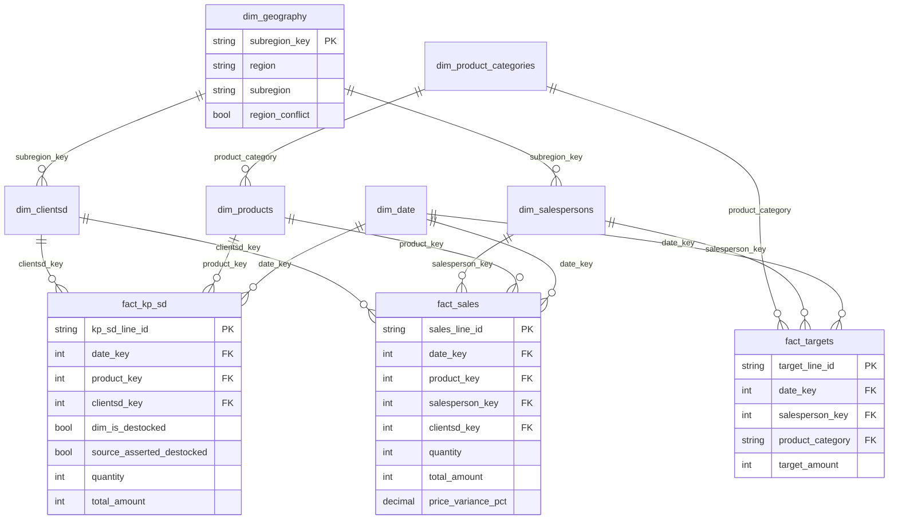

# Power BI Desktop Report Design Plan (v4 — model complete, entering build phase)
## Distribution Analytics Platform — Sell-In, Sell-Out, Regional & Target Attainment

**Model status: complete.** Every table, relationship, role, and measure below is now
verified against the real, final `choco_sales_model.bim` — not the aspirational
version from earlier drafts. What changed to get here:

| Item | Status |
|---|---|
| Source | Switched from CSV (`master_csv_folder`) to Parquet (`master_parquet_folder`) — CSV stays reserved for the separate Excel export workflow |
| `dim_geography` | Built — conforms `region`/`subregion` from `dim_clientsd` + `dim_salespersons`, normalizes hand-typed casing drift, flags real conflicts instead of silently resolving them |
| RLS | 5 roles built (Sales Rep, Supervisor, Regional Manager, Sales Director, Data Analyst) — see §5 |
| `fact_kp_sd` | Built and related to `dim_clientsd`/`dim_date`/`dim_products` — sell-in analysis is now live |
| Measures | Complete, **except** `Weighted Avg Price Variance %` — `fact_sales` genuinely doesn't carry the pricing columns needed (`price_variance_pct` etc. are stripped in Power Query); this is the one open item, flagged inline wherever it appears below |
| Naming | Every table/measure reference below now matches the real model exactly (`fact_sales` not `FactSales`, `Revenue` not `Sell-Out Amount`, `% Achievement` not `Attainment %`, etc.) — this document went through several drafts using idealized names before the model existed; those are reconciled now |

One structural note carried over from getting `dim_geography` working: `dim_clientsd →
dim_geography` is **inactive** (Power BI won't allow two simultaneous active paths from
`fact_sales` to the same table — see §2). `dim_salespersons → dim_geography` is the
live path; anything needing the client-side path (e.g. sell-in by region) activates it
explicitly with `USERELATIONSHIP` (§3.05b).

**This document now covers §1–§5 (the model) and §7 (page-by-page build guide).** §7 is
where the hands-on work happens from here — each page has exact visual types, field
wells, and formatting, not just a bullet list of intent.

---

## 1. Source tables → Power BI tables

| Power BI table | Source model | Grain |
|---|---|---|
| `fact_sales` | `marts.fact_sales` | 1 row / `sales_line_id` (daily sell-out line) |
| `fact_kp_sd` | `marts.fact_kp_sd` | 1 row / `kp_sd_line_id` (KP→SD shipment line) |
| `fact_targets` | `marts.fact_targets` | 1 row / `target_line_id` (salesperson × category × month) |
| `dim_date` | `marts.dim_date` | 1 row / day, 2024-10-01 → 2035-12-31 |
| `dim_products` | `marts.dim_products` | SCD2 by time, 1 row / SKU-version |
| `dim_salespersons` | `marts.dim_salesperson` | SCD2 by column, 1 row / salesperson-version |
| `dim_clientsd` | `marts.dim_clientsd` | SCD2 by column, 1 row / SD-version |
| `dim_product_categories` | *new — built in Power Query* | 1 row / distinct `product_category` |
| `dim_geography` | *new — built in Power Query* | 1 row / distinct `subregion` (Region → Subregion hierarchy) |

**Connector:** Parquet connector against `data/exports/parquet/<env>/`, Import mode.
`fact_sales`/`fact_kp_sd` are `INCREMENTAL_BY_TIME_RANGE` and already partitioned by
`sale_year`/`sale_month` — set up **Power BI incremental refresh** on `fact_sales` and
`fact_kp_sd` using `sale_date` as the RangeStart/RangeEnd column, so refresh only pulls
recent partitions instead of the full table every time. `fact_targets` is `FULL` and
small — plain full refresh is fine.

**Global option:** turn off File → Options → Data Load → **Auto Date/Time** — `dim_date`
is the single date table; letting Power BI spawn a hidden calendar per date column would
silently give you two different fiscal calendars in the same model.

### `dim_product_categories` (new bridge table)

`fact_targets.product_category` is free text — not a foreign key into `dim_products`.
To compare category-level targets against SKU-level actuals, both sides need to relate
through one conformed category list, built in Power Query rather than trusted from
either source alone (so a category that exists only in targets, or only in products,
doesn't silently disappear from one side):

```m
let
    FromProducts = Table.SelectColumns(
        Table.TransformColumns(dim_products, {"product_category", Text.Trim}),
        {"product_category"}
    ),
    FromTargets = Table.SelectColumns(
        Table.TransformColumns(fact_targets, {"product_category", Text.Trim}),
        {"product_category"}
    ),
    Combined = Table.Distinct(Table.Combine({FromProducts, FromTargets})),
    Sorted   = Table.Sort(Combined, {{"product_category", Order.Ascending}})
in
    Sorted
```

`Text.Trim` guards against whitespace drift; if category *casing* also drifts between
the two source systems (e.g. `"Boissons"` vs `"boissons"`), normalize with
`Text.Proper` in the same step — worth a quick check against real data before trusting
the bridge.

### `dim_geography` (new — the table region/subregion were missing)

`region`/`subregion` are hand-typed on **two** source tables (`dim_clientsd`,
`dim_salespersons`) with no relationship between them today — a "region" slicer built
against one wouldn't touch the other, and casing drift (`"littoral"` vs `"Littoral"`)
would silently split what should be one region into two. This table conforms both into
a single governed list, the same way `dim_product_categories` conforms categories from two
sources above, extended with a stricter join key since region/subregion drift is
expected to be worse than category drift:

```m
let
    FromClients = Table.SelectColumns(
        Table.TransformColumns(dim_clientsd, {{"region", Text.Trim}, {"subregion", Text.Trim}}),
        {"region", "subregion"}
    ),
    FromSalespersons = Table.SelectColumns(
        Table.TransformColumns(dim_salespersons, {{"region", Text.Trim}, {"subregion", Text.Trim}}),
        {"region", "subregion"}
    ),
    Combined = Table.Combine({FromClients, FromSalespersons}),

    // Canonical display casing
    Proper = Table.TransformColumns(Combined, {{"region", Text.Proper}, {"subregion", Text.Proper}}),

    // Join key: TRIM(UPPER(...)) mirrors the SKU-matching normalization already
    // used in the SQLMesh staging layer, applied here for platform consistency.
    WithKey = Table.AddColumn(Proper, "subregion_key", each Text.Upper(Text.Trim([subregion])), type text),

    // Group so subregion_key is unique -- Power BI requires a unique key on the "one"
    // side of a relationship. Assumes each subregion belongs to exactly one region;
    // verify against real data (build checklist §12). If a supervisor ever hand-types
    // the same subregion under two different regions, this concatenates both region
    // names into one visible value and flags region_conflict = TRUE, instead of
    // silently picking one -- the conflict should surface on the Data Quality page,
    // not disappear here.
    Grouped = Table.Group(WithKey, {"subregion_key"}, {
        {"region", each Text.Combine(List.Distinct([region]), " / "), type text},
        {"subregion", each [subregion]{0}, type text},
        {"region_conflict", each List.Count(List.Distinct([region])) > 1, type logical}
    }),

    Sorted = Table.Sort(Grouped, {{"region", Order.Ascending}, {"subregion", Order.Ascending}})
in
    Sorted
```

`dim_clientsd` and `dim_salespersons` each get a matching calculated column,
`subregion_key = TRIM(UPPER([subregion]))`, as the join key back to `dim_geography` —
hidden, technical, used for relationships only. The raw `region`/`subregion` columns on
those two tables stay **visible** (consistent with how `product_category` stays visible
on `dim_products` even though `dim_product_categories` exists); `dim_geography` is the
governed, cross-fact slicer, not a replacement for the per-dimension columns.

---

## 2. Semantic model (star / snowflake)



**Relationships — all single-direction, dimension → fact, active:**

| From | To |
|---|---|
| `dim_date[date_key]` | `fact_sales[date_key]`, `fact_kp_sd[date_key]`, `fact_targets[date_key]` |
| `dim_products[product_key]` | `fact_sales[product_key]`, `fact_kp_sd[product_key]` |
| `dim_salespersons[salesperson_key]` | `fact_sales[salesperson_key]`, `fact_targets[salesperson_key]` |
| `dim_clientsd[clientsd_key]` | `fact_sales[clientsd_key]`, `fact_kp_sd[clientsd_key]` |
| `dim_product_categories[product_category]` | `dim_products[product_category]`, `fact_targets[product_category]` |
| `dim_geography[subregion_key]` | `dim_clientsd[subregion_key]`, `dim_salespersons[subregion_key]` |

No bidirectional relationships anywhere — filtering `dim_product_categories` reaches
`fact_sales` transitively through `dim_products` (single-direction chains propagate
filters through in Power BI without needing to flip cross-filter direction). Filtering
`dim_geography` reaches `fact_sales` and `fact_targets` transitively through
`dim_salespersons`, and reaches `fact_sales`/`fact_kp_sd` transitively through `dim_clientsd`
— the same subregion filters both the "who sold it" side and the "who bought it" side
at once, which is what makes a client-region-vs-salesperson-region reconciliation
possible instead of two disconnected region slicers.

`fact_targets[date_key]` will resolve to whatever single day `target_month` was stored
as (normally the 1st of the month) — that's expected and fine; every visual should
group by `dim_date[month_name]`/`[year_month]`/`[fiscal_year]`, not by the raw date, so
the day-vs-month grain mismatch between `fact_targets` and the daily `dim_date` never
surfaces to the user.

**`dim_date` setup:** Mark as date table on `date_actual`. Sort `month_name` by `month`,
`day_name` by `day_of_week`, `quarter_name` by `quarter`. Note the **fiscal year starts
in October** (`fiscal_year`/`fiscal_month`/`fiscal_quarter` columns already computed) —
this drives the calculation group in §4.

**Hidden fields (governed single source of truth):**
- All `_key` surrogate columns (relationships only), including the new
  `subregion_key` calculated columns on `dim_clientsd`/`dim_salespersons` and on
  `dim_geography` — technical join fields, not for report authors.
- The **denormalized copies** of `region`, `subregion`, `sales_channel`,
  `supervisor_name` that `fact_sales` carries directly (they were pulled from
  `dim_salesperson` at the point-in-time of the SCD2 join at build time — since
  `fact_sales` already relates to `dim_salespersons` via the correctly-versioned
  `salesperson_key`, slicing through the dimension gives the identical, point-in-time-
  correct value without a second copy of the same fact floating around the model).
  **`region`/`subregion` themselves are not hidden anywhere else** — they're visible
  on `dim_clientsd`, `dim_salespersons`, and `dim_geography`; only the fact-table copies
  are hidden, same treatment as `sales_channel`/`supervisor_name`.
- `sale_year`, `sale_month`, `target_year`, `target_month_num` (partition columns —
  use `dim_date` attributes for any grouping instead).
- `region_conflict` on `dim_geography` — drives `# Subregions With Region Conflict` in
  §3 but isn't something a report viewer needs to see directly; the Data Quality page
  is where a conflict, if one exists, should surface.
- ⚠ `unit_price_standard`, `unit_weight_standard`, `unit_weight_actual`,
  `unit_price_actual`, `price_variance_pct` are described here as "kept but hidden,"
  but the actual `.bim`'s Power Query step **removes** these columns from `fact_sales`
  entirely — they aren't in the model to hide. The `Weighted Avg Price Variance %`
  measure in §3 and the pricing-drift visuals on pages 4 and 7 need one of: (a)
  re-adding these columns to the `fact_sales` Power Query step, or (b) dropping the
  pricing-variance workstream from this build. Flagged, not resolved, here.

**Row-level security (optional):** a role filtering `dim_salespersons[salesperson_id] =
USERPRINCIPALNAME()`-style lookup, propagated to `fact_sales`/`fact_targets` through the
existing relationships, if reps get direct access later.

---

## 3. Measures (DAX)

One hidden `_Measures` table, display folders as shown.

### 📁 00 Sell-Out (`fact_sales`)

```dax
Revenue = SUM ( fact_sales[total_amount] )
Total Qty = SUM ( fact_sales[quantity] )
Sell-Out Weight (kg) = SUM ( fact_sales[total_weight_kg] )
# Sales Lines = COUNTROWS ( fact_sales )

Weighted Avg Price Variance % =
DIVIDE (
    SUMX ( fact_sales, fact_sales[quantity] * fact_sales[price_variance_pct] ),
    SUM ( fact_sales[quantity] )
)
```

`price_variance_pct` is already a per-line percentage — never `AVERAGE()` it directly
(that weights every line equally regardless of volume); the qty-weighted version above
is the correct aggregate.

### 📁 01 Sell-In (`fact_kp_sd`)

```dax
Sell-In Amount = SUM ( fact_kp_sd[total_amount] )
Sell-In Qty = SUM ( fact_kp_sd[quantity] )
# KP-SD Lines = COUNTROWS ( fact_kp_sd )
```

### 📁 02 Sell-Through

```dax
Sell-Through Ratio =
DIVIDE ( [Revenue], [Sell-In Amount] )

Sell-Through Ratio (Qty) =
DIVIDE ( [Total Qty], [Sell-In Qty] )

Sell-In vs Sell-Out Gap =
[Sell-In Amount] - [Revenue]
```

Valid anywhere both facts share filter context through `dim_clientsd` / `dim_products` /
`dim_date` — e.g. by SD, by month, by category. Not meaningful sliced by
`dim_salespersons` (KP-SD has no salesperson dimension) — leave that field out of any
visual using these three measures.

### 📁 03 Targets & Attainment

```dax
Target Amount = SUM ( fact_targets[target_amount] )

% Achievement =
DIVIDE ( [Revenue], [Target Amount] )

Gap Amount =
[Revenue] - [Target Amount]

Attainment Status =
VAR pct = [% Achievement]
RETURN
    SWITCH (
        TRUE (),
        ISBLANK ( pct ), "No target",
        pct >= 1, "✅ On target",
        pct >= 0.85, "⚠ Watch",
        "🔴 Below target"
    )

Attainment Status Color =
VAR pct = [% Achievement]
RETURN
    SWITCH (
        TRUE (),
        ISBLANK ( pct ), "#BDBDBD",
        pct >= 1, "#2E7D32",
        pct >= 0.85, "#F9A825",
        "#C62828"
    )
```

`% Achievement` only holds together when both `Revenue` and `Target Amount` are
filtered to the same `dim_product_categories` / `dim_salespersons` / `dim_date` context —
i.e., always use `dim_product_categories[product_category]` in a visual, never
`dim_products[product_category]` directly, or the target side of the ratio silently
won't filter.

### 📁 04 Pace & Risk

```dax
Days Elapsed In Month = DATEDIFF ( STARTOFMONTH ( TODAY () ), TODAY (), DAY ) + 1
Days In Month = DAY ( EOMONTH ( TODAY (), 0 ) )
Period Progress % = DIVIDE ( [Days Elapsed In Month], [Days In Month] )
Pace-Adjusted Target = [Target Amount] * [Period Progress %]
Pace % Achievement = DIVIDE ( [Revenue], [Pace-Adjusted Target] )

# Reps At Risk =
VAR RepTable =
    ADDCOLUMNS (
        VALUES ( dim_salespersons[salesperson_key] ),
        "@Pace", [Pace % Achievement]
    )
RETURN
    COUNTROWS ( FILTER ( RepTable, [@Pace] < 0.85 ) )
```

`# Reps At Risk` deliberately evaluates the ratio per-rep first, then counts — summing
or averaging a ratio column across reps before filtering would understate risk (a few
very large on-track reps mathematically hide many small at-risk ones).

### 📁 05 Ranking

```dax
Rank Salesperson =
RANKX ( ALL ( dim_salespersons[salesperson_name] ), [% Achievement], , DESC, DENSE )

Rep Rank (Revenue) =
RANKX ( ALL ( dim_salespersons[salesperson_name] ), [Revenue], , DESC, DENSE )

SD Rank (Revenue) =
RANKX ( ALL ( dim_clientsd[clientsd_name] ), [Revenue], , DESC, DENSE )

KP Rank (Sell-In Amount) =
RANKX ( ALL ( dim_clientsd[key_player] ), [Sell-In Amount], , DESC, DENSE )
```

### 📁 05b Geography

```dax
Region Rank (Revenue) =
RANKX ( ALL ( dim_geography[region] ), [Revenue], , DESC, DENSE )

Subregion Rank (Revenue) =
RANKX ( ALL ( dim_geography[subregion] ), [Revenue], , DESC, DENSE )

# Subregions With Region Conflict =
CALCULATE ( COUNTROWS ( dim_geography ), dim_geography[region_conflict] = TRUE () )
```

`ALL ( dim_geography[region] )` reaches `fact_sales`/`fact_targets` through
`dim_salespersons`, the one active path — the `dim_clientsd → dim_geography`
relationship is deliberately **inactive** (Power BI won't allow both simultaneously;
see the "ambiguous path" note in §2). A sell-in-by-region measure against `fact_kp_sd`
needs to activate the other path explicitly:
`CALCULATE([Sell-In Amount], USERELATIONSHIP(dim_geography[subregion_key], dim_clientsd[subregion_key]))`.
`# Subregions With Region Conflict` should read `0`; if it doesn't, that's a hand-typed
region/subregion mismatch between `dim_clientsd` and `dim_salespersons` worth
root-causing on the Data Quality page (§7.09) rather than ignoring — see the
`dim_geography` build note in §1.

### 📁 06 Data Quality

*(directly targeting the two audits that are currently commented out in the SQL)*

```dax
-- fact_sales' client-FK audit is commented out — this is the BI-side backstop
# Sales Lines Missing Client Link =
CALCULATE ( COUNTROWS ( fact_sales ), ISBLANK ( fact_sales[clientsd_key] ) )

-- fact_kp_sd's destocked-consistency audit is commented out — same idea
# Destock Flag Mismatches =
CALCULATE (
    COUNTROWS ( fact_kp_sd ),
    fact_kp_sd[dim_is_destocked] <> fact_kp_sd[source_asserted_destocked]
)

Destock Mismatch Rate =
DIVIDE ( [# Destock Flag Mismatches], [# KP-SD Lines] )

# Pricing Exceptions (>10%) =
CALCULATE ( COUNTROWS ( fact_sales ), ABS ( fact_sales[price_variance_pct] ) > 10 )
```

### Format strings

| Measure family | Format string |
|---|---|
| `*Amount`, `*Target*`, `*Gap*` | `#,##0 "XAF"` (integer — XAF has no subunit) |
| `*Qty`, `*Weight*`, `# *` counts | `#,##0` |
| `% Achievement`, `*Progress %`, `Pace % Achievement`, `Destock Mismatch Rate`, `*Variance %` | `0.0%;-0.0%;0.0%` |
| `Sell-Through Ratio*` | `0%` |
| `*Rank*` (incl. `Region Rank*`, `Subregion Rank*`) | `0` |

---

## 4. Calculation group — Time Intelligence

Author natively in **Model view → Model explorer → right-click Tables → New
calculation group** (Power BI Desktop supports this directly now; Tabular Editor is
still an option for a richer editing UI but isn't required). Base measures must stay
**explicit** — every measure in §3 already is.

**Table:** `Time Intelligence`, column `Time Calculation`, precedence `1`.

```dax
Current = SELECTEDMEASURE ()

MTD = CALCULATE ( SELECTEDMEASURE (), DATESMTD ( dim_date[date_actual] ) )

QTD = CALCULATE ( SELECTEDMEASURE (), DATESQTD ( dim_date[date_actual] ) )

-- Fiscal year starts October 1 → fiscal year-end boundary is Sept 30
FYTD =
CALCULATE ( SELECTEDMEASURE (), DATESYTD ( dim_date[date_actual], "09-30" ) )

PY = CALCULATE ( SELECTEDMEASURE (), SAMEPERIODLASTYEAR ( dim_date[date_actual] ) )

PY FYTD =
CALCULATE (
    SELECTEDMEASURE (),
    DATESYTD ( DATEADD ( dim_date[date_actual], -1, YEAR ), "09-30" )
)

YoY Δ =
SELECTEDMEASURE ()
    - CALCULATE ( SELECTEDMEASURE (), SAMEPERIODLASTYEAR ( dim_date[date_actual] ) )

YoY % =
DIVIDE (
    SELECTEDMEASURE ()
        - CALCULATE ( SELECTEDMEASURE (), SAMEPERIODLASTYEAR ( dim_date[date_actual] ) ),
    CALCULATE ( SELECTEDMEASURE (), SAMEPERIODLASTYEAR ( dim_date[date_actual] ) )
)
```

Set a dynamic format string on `YoY %` (`0.0%;-0.0%`); leave the rest on
`SELECTEDMEASUREFORMATSTRING()` so `FYTD` on `Revenue` still renders as XAF
while `FYTD` on `% Achievement` still renders as a percentage. Using
`dim_date[fiscal_year]` for a plain fiscal-year slicer (rather than the calc group) also
works fine for non-cumulative fiscal-year filtering — the calc group is specifically
for the *to-date* and *prior-period* patterns.

---

## 5. Row-level security

Five roles, `dim_rls_access` (hidden mapping table: `user_email` → `access_role` →
`access_value`) as the single place identities get maintained instead of hardcoding
names into DAX.

| Role | Filters | Sees |
|---|---|---|
| **Sales Rep** | `dim_salespersons[salesperson_id]` = their mapped ID; `dim_clientsd` restricted to SDs their own `fact_sales` rows actually touch | Their own transactions and the SDs they've personally sold through |
| **Supervisor** | `dim_salespersons[supervisor_name]` = their mapped name; `dim_clientsd[supervisor_name]` = same (direct assignment, not derived from transactions) | Their reps + their directly-assigned SDs, even ones with no sales yet |
| **Regional Manager** | `dim_clientsd[region]` and `dim_salespersons[region]` = their mapped region (two direct filters, not routed through `dim_geography` — see the ambiguous-path note in §2) | Everything in their region — reps, SDs, and (once `fact_kp_sd` is related) sell-in too |
| **Sales Director** | none | Everything |
| **Data Analyst** | none | Everything |

Every identity comparison is wrapped in `TRIM(UPPER(...))` on both sides — these are
hand-typed fields (`supervisor_name` exists independently on two tables,
`dim_rls_access` is a third independently-typed copy), and a casing mismatch here is a
security bug, not a cosmetic one. Every `LOOKUPVALUE` supplies `BLANK()` as the
alternate result — an unmapped user sees nothing, not everything (fail closed).

**One DAX restriction that bit us building this, worth knowing before touching these
rules again:** `LOOKUPVALUE` can't be used directly inside a boolean that's passed as a
filter *argument* to `CALCULATETABLE`/`CALCULATE` (Sales Rep's `dim_clientsd` rule hits
this, since it derives SD access from `fact_sales` transactions). Fix is to resolve the
`LOOKUPVALUE` into a `VAR` first, then compare the column to the variable — a plain
column-to-scalar comparison is allowed in that position, a function call isn't.

**Known gotcha, not a bug:** Power BI takes the *union* of every role a user is
assigned to. A user in both "Supervisor" and "Sales Director" sees everything — the
Director role wins by default, silently. Worth a periodic membership audit once this
is live in the Service, not just a one-time setup.

**Not covered:** column-level restriction (e.g. hiding margin fields from reps even on
their own rows). That's Object-Level Security, needs Tabular Editor, not built here.

---

## 6. Report architecture

| # | Page | In nav | Purpose |
|---|---|---|---|
| 1 | **Home** | ✅ | Landing/menu |
| 2 | **Executive Overview** | ✅ | Cross-cutting KPIs: sell-out, sell-in, attainment, sell-through, alerts |
| 3 | **Regional Performance** *(new)* | ✅ | `dim_geography` deep dive — Region → Subregion drill, client-side vs salesperson-side reconciliation |
| 4 | **Sales Performance (Sell-Out)** | ✅ | `fact_sales` deep dive — channel, product, pricing |
| 5 | **Sell-In vs Sell-Out** | ✅ | `fact_kp_sd` vs `fact_sales` reconciliation, KP rollup, destocké split |
| 6 | **Rep Target Attainment** | ✅ | Leaderboard + At-Risk watchlist (bookmark-toggled), category-level attainment |
| 7 | **Product Performance** | ✅ | Category/subcategory mix, innovation split, pricing exceptions |
| 8 | **Client (SD) Performance** | ✅ | SD rankings, KP breakdown, destocké mix |
| 9 | **Data Quality** | ✅ | The two unguarded checks from §3.06, region-conflict check, plus freshness |
| 10 | *Rep Detail* | 🔒 hidden | Drillthrough from page 6 |
| 11 | *SD Detail* | 🔒 hidden | Drillthrough from page 8 |
| 12 | *Trend Tooltip* | 🔒 hidden | Report-page tooltip |

**Navigation:** native **Page navigator** visual on an identical locked header band
(top ~60px) on every visible page — platform name (left), navigator (center), a
"Filters ▾" toggle and "🔄 Reset" button (right). Hidden pages carry no navigator entry.

---

## 7. Page-by-page design

### Page 1 — Home
Title, one-paragraph orientation, 6 shortcut tiles (buttons → page navigation) to
pages 2–5, 7–8. No data visuals — a landing page should be wayfinding-only.

### Page 2 — Executive Overview
**Slicers (synced across pages 2–8):** `dim_date[year_month]`, `dim_geography[region]`,
`dim_product_categories[product_category]`.
(Still no channel/team slicer here deliberately — this page is the 10-second read. But
region *is* added to the synced set now — it's one of the two or three cuts users
actually ask for first, not a niche filter.)

- 5 KPI cards: `Revenue`, `Sell-In Amount`, `% Achievement`, `Sell-Through Ratio`,
  `# Reps At Risk` — each with `Attainment Status Color` conditional formatting where relevant.
- Combo chart: `Revenue` (columns) vs `Target Amount` (line) by `year_month`,
  12-month trailing.
- Horizontal bar: `% Achievement` by `sales_channel` (SD vs DG), 100% reference line.
- Alert strip (3 small cards): `# Reps At Risk`, `# Destock Flag Mismatches`,
  `# Sales Lines Missing Client Link` — each a button drilling to the relevant detail
  page (6, 9, 9).

The regional breakdown itself stays off this page by design — that's the whole point
of page 3 below — but the `dim_geography[region]` slicer means the exec KPIs can
already be viewed "for the North region only" etc. without leaving this page.

### Page 3 — Regional Performance *(new)*
**Slicers:** `year_month` (synced), `region` (synced — drives the `Geography`
hierarchy drill below).

- KPI row: `Revenue`, `Target Amount`, `% Achievement`, `# Subregions With
  Region Conflict` (should read 0 — a non-zero value means a supervisor typed the same
  subregion under two different regions somewhere; see §1 `dim_geography` build note
  and the Data Quality page).
- Matrix: rows = `dim_geography` **Geography hierarchy** (Region, drill to Subregion),
  columns = `Revenue`, `Target Amount`, `% Achievement` (`Attainment Status
  Color` conditional formatting), `Subregion Rank (Revenue)` — the primary
  explore-by-territory view.
- Bar: `Revenue` by `region`, sorted descending — headline regional ranking,
  same pattern as the product/SD ranking bars elsewhere.
- Matrix: rows = `dim_clientsd[subregion]` (client's territory), columns =
  `dim_salespersons[subregion]` (rep's assigned territory), values = `Revenue`
  — off-diagonal cells are sales happening outside a rep's assigned subregion. This
  works with no special DAX: `fact_sales` has two independent active relationships
  (through `dim_clientsd` and through `dim_salespersons`), and a matrix cell applies both
  filters at once. This specific reconciliation wasn't buildable before `dim_geography`
  existed, because there was nothing forcing the two sides' region/subregion spellings
  to line up.
- **No map visual.** `region`/`subregion` are internal sales territories, not
  Bing-Maps-resolvable places — plotting them on a filled or bubble map would silently
  mis-geocode or blank out. Use the bar/matrix above instead (this is also why the
  stray `dataCategory: "City"` tag on these columns was removed in the `.bim` update —
  leaving it in place invites exactly this mistake later).

### Page 4 — Sales Performance (Sell-Out)
**Slicers:** `year_month`, `region` (synced), `sales_channel` (SD/DG), `product_category`.

- KPI row: `Revenue`, `Total Qty`, `Weighted Avg Price Variance %` ⚠ *(see
  §2 finding — `price_variance_pct` isn't in the current `fact_sales` build; this card
  won't compute until that's resolved)*.
- Line chart: `Revenue` trend by `year_month`, split by `sales_channel`.
- Bar: `Revenue` by `product_category`, top 15, sorted descending.
- Table: `product_name`, `Revenue`, `Weighted Avg Price Variance %` (data bars)
  ⚠ *(same caveat)*, sorted by |variance| descending — surfaces pricing drift without a
  separate page.

### Page 5 — Sell-In vs Sell-Out
**Slicers:** `year_month`, `region` (synced — now meaningful on this page too, since
`dim_clientsd` routes through `dim_geography`), `key_player`, `is_destocked`.

- KPI row: `Sell-In Amount`, `Revenue`, `Sell-Through Ratio`.
- Combo chart: `Sell-In Amount` vs `Revenue` by `year_month`.
- Bar: `Sell-In Amount` by `key_player` (KP rollup across all its SDs) —
  `v_kp_performance_kpi` equivalent.
- 100%-stacked bar: `Sell-In Amount` split `is_destocked` true/false, by month —
  destocké vs non-destocké mix over time.
- Table: `clientsd_name`, `Sell-In Amount`, `Revenue`, `Sell-Through Ratio`, sorted
  ascending on ratio — SDs sitting on inventory surface at the top.

### Page 6 — Rep Target Attainment
**Slicers:** `year_month`, `region` (synced), `sales_channel`, `product_category`,
search-enabled `salesperson_name` list slicer.

- Matrix: rows = `salesperson_name`, columns = `Revenue`, `Target Amount`,
  `% Achievement` (data bars, `Attainment Status Color` conditional formatting),
  `Rank Salesperson`.
- Scatter: X = `Revenue`, Y = `% Achievement`, one bubble per rep, 100%
  reference line.
- **Bookmark toggle** ("Leaderboard" / "At-Risk Watchlist"): second view swaps the
  matrix for a table filtered to `Pace % Achievement < 0.85`
  (`salesperson_name`, `Revenue`, `Pace-Adjusted Target`,
  `Pace % Achievement`, icon set), plus a gauge on `Pace % Achievement` — keeps the
  watchlist one click away without a dedicated page.
- **Drillthrough** on `salesperson_name` → *Rep Detail* (page 10), passing
  `salesperson_key`.

### Page 7 — Product Performance
**Slicers:** `year_month`, `product_category`, `is_innovation_product`.

- Decomposition tree: root `Revenue`, split by `product_category` →
  `product_subcategory` → `product_name` — lets you explore the actual driver
  hierarchy rather than pre-committing to one breakdown.
- Pareto combo: bars = `Revenue` by `product_name` (top 20), line = cumulative %.
- Donut or 100%-stacked bar: `Revenue` split `is_innovation_product`.
- Table: `product_name`, `Weighted Avg Price Variance %` ⚠ *(§2 finding)*,
  `# Pricing Exceptions (>10%)` flag, sorted worst-first.

Region intentionally stays off this page — product mix isn't primarily a territory
question here, and page 3 already owns the regional cut. Cross-reference via the
synced `year_month` slicer if needed.

### Page 8 — Client (SD) Performance
**Slicers:** `year_month`, `region` (synced), `key_player`, `is_destocked`.

- Table: `clientsd_name`, `region`, `subregion`, `Revenue`, `Sell-In Amount`,
  `SD Rank (Revenue)`, sorted descending, top/bottom toggled via a
  visual-level Top N filter.
- Bar: `Revenue` by `clientsd_name`, top 15.
- **Drillthrough** on `clientsd_name` → *SD Detail* (page 11), passing `clientsd_key`.

### Page 9 — Data Quality
No cross-page slicer sync (deliberately isolated — this page audits the whole dataset,
not a filtered slice of it).

- 4 KPI cards: `# Sales Lines Missing Client Link`, `# Destock Flag Mismatches` /
  `Destock Mismatch Rate`, `# Pricing Exceptions (>10%)`, `# Subregions With Region
  Conflict`.
- Note box (text visual, not data-bound): *"These three checks exist as commented-out
  or unwired SQLMesh audits (`assert_no_orphaned_client`,
  `assert_destocked_flag_consistency`). This page is the interim backstop until they're
  wired into the pipeline — remove once the corresponding audit is active in `sqlmesh
  audit`."* — keeps the reason this page exists visible to whoever maintains the report
  after you.
- Second note box: *"`# Subregions With Region Conflict` flags a subregion hand-typed
  under two different regions across `dim_clientsd`/`dim_salespersons` — a modeling
  safeguard in `dim_geography`, not a SQLMesh audit. See the build note in §1."*
- Table: `fact_kp_sd` rows where `dim_is_destocked <> source_asserted_destocked`, for
  root-causing individual mismatches, not just counting them.
- Table (conditionally shown, only if the KPI card above is non-zero): `dim_geography`
  rows where `region_conflict = TRUE`, showing the conflicting `region` values
  concatenated — root-causes which subregion needs a supervisor follow-up.

### Page 10 (hidden) — Rep Detail (drillthrough)
Header card (name, `sales_channel`, `supervisor_name`, `region`, `subregion`) · trend
line (`Revenue` vs `Target Amount` by `year_month`, full history) · table
(monthly × category breakdown). Auto-inserted back button kept.

### Page 11 (hidden) — SD Detail (drillthrough)
Header card (`clientsd_name`, `key_player`, `is_destocked`, `region`, `subregion`) · combo
chart (`Sell-In Amount` vs `Revenue` by `year_month`) · table (monthly ×
product breakdown).

### Page 12 (hidden) — Trend Tooltip
Tooltip page size (320×240px), single sparkline, no chrome — assigned to the trend
charts on pages 2–5.

---

## 8. Bookmarks

**Folder "Reset":** `Reset Filters` (Data ✅ / Display ❌ / Current page ❌), bound to
the header "🔄 Reset" button, reused identically on every visible page.

**Folder "View toggles":**
- `Filter Pane – Shown` / `Filter Pane – Hidden` (Display only).
- `Leaderboard View` / `Watchlist View` on page 6 (Display only — swaps the matrix/
  scatter group for the at-risk table/gauge group).

All bookmarks: only the visuals actually changing are selected (uncheck "All visuals"),
so an unrelated slicer on the same page never gets silently reset by an unrelated toggle.

---

## 9. Data-visualization best practices applied

- Green/amber/red reserved exclusively for attainment/risk status
  (`Attainment Status Color`); the 8-color categorical palette used for channel/
  category/KP is a separate, unrelated set.
- No pies for >2 categories — bars, 100%-stacked bars, or the decomposition tree instead.
- Bar/column axes always start at zero.
- 100% reference lines (attainment, sell-through) via the Analytics pane, not a second
  data series.
- XAF integer formatting everywhere; axis labels auto-abbreviated (K/M), full precision
  in tooltips/tables.
- Page 9 exists specifically so an unresolved data-quality gap is *visible*, not buried
  in a filtered-out corner of another page — the same "never silently drop" instinct the
  SQLMesh audits already encode. `dim_geography`'s `region_conflict` flag follows the
  same rule (§1, §3.05b): a casing/entry conflict concatenates and surfaces rather than
  silently resolving to one value.
- No map/filled-map visuals against `region`/`subregion` — they're internal sales
  territories, not Bing-Maps-geocodable places (this is also why the incorrect
  `dataCategory: "City"` tag was removed from these columns in the `.bim`). Bars and
  the `Geography` hierarchy matrix on page 3 carry that job instead.
- Alt text on every visual; explicit tab order per page for keyboard navigation.

---

## 10. Theme

The `theme.json` from the first draft is schema-generic and still applies unchanged —
`good`/`neutral`/`bad` map onto `Attainment Status Color`, and the 8-slot categorical
palette comfortably covers `sales_channel` (2 values: SD/DG), `is_destocked` (2 values),
and `product_category` (assume ≤8 top-level categories; if there are more, group the
long tail into "Other" in a visual-level filter rather than letting the palette repeat
colors across unrelated categories).

---

## 11. Performance notes

- `fact_sales`/`fact_kp_sd` incremental refresh (§1) is the single highest-leverage
  performance decision here — both tables grow daily/monthly and are already
  parquet-partitioned by `sale_year`/`sale_month`, so the refresh policy folds cleanly.
- Keep the star schema flat (no bidirectional relationships) — every "fact-to-fact"
  comparison in this report (`Sell-Through Ratio`, `% Achievement`) is achieved by
  filtering shared dimensions, never by relating the two fact tables to each other.
- `dim_products` and `dim_salespersons` are SCD2 — expect more rows than there are unique
  SKUs/reps. That's correct and required for point-in-time accuracy; don't "fix" it by
  collapsing to current-only rows unless a specific visual explicitly wants a
  current-roster-only view (in which case filter on `valid_to = BLANK()` in that visual,
  not at the model level).

---

## 12. Build checklist

**Model — done:**
- [x] Parquet source (§1), `dim_geography` + `dim_product_categories` built, all relationships
      wired (§2), 5 RLS roles built (§5), `fact_kp_sd` built and related, all measures
      complete except `Weighted Avg Price Variance %` (§3 — genuinely blocked, `fact_sales`
      doesn't carry the pricing columns; re-add them upstream or drop the two dependent
      visuals on pages 4 and 7 if this stays out of scope).

**Report — in progress, page by page (§7):**
1. [ ] Import `theme.json`.
2. [ ] Pages 1–9, then hidden pages 10–12 — this is the current phase, one page at a time.
3. [ ] Page navigator, drillthroughs, tooltip page.
4. [ ] Bookmarks (§8); test each toggle in isolation.
5. [ ] Alt text + tab order pass.
6. [ ] **RLS smoke test**: Modeling → View As Roles for each of the 5 roles before
       publishing — confirm a Sales Rep only sees their own rows, a Regional Manager
       only their region, and that Sales Director/Data Analyst see everything. This is
       the one item here that's a genuine security check, not a polish pass.
7. [ ] Incremental refresh policy on `fact_sales`/`fact_kp_sd`; scheduled refresh setup.
